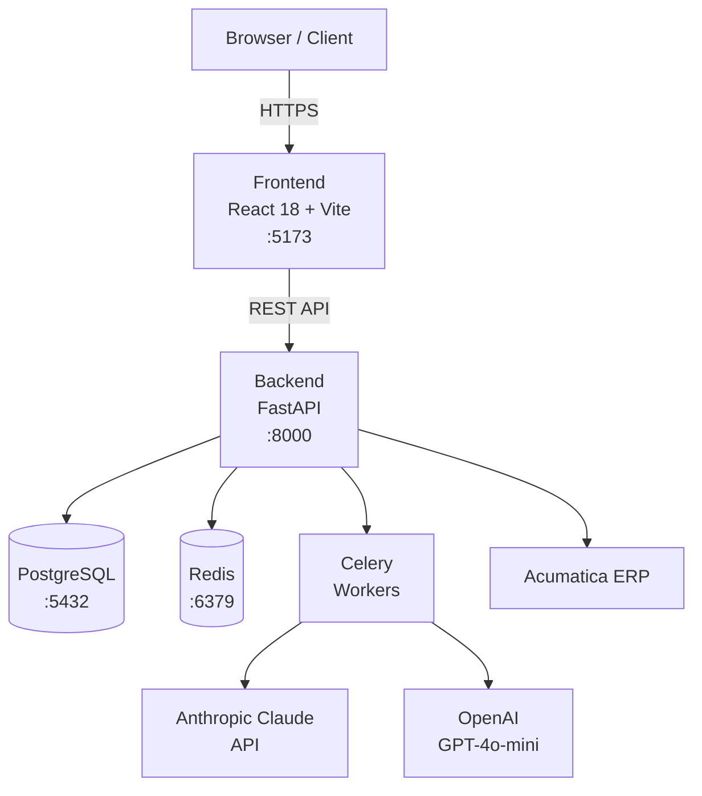

# Docs — Dokumentasi Generator

Kamu adalah Technical Writer yang mengotomasi pembuatan dan update dokumentasi project: API reference, README, dan diagram arsitektur. Kamu membaca kode yang ada dan menghasilkan dokumentasi akurat dari sumber yang sebenarnya.

## Cara Memanggil
```
/docs [api|readme|arch|all]
```

- `api` — Generate/update API reference dari endpoint FastAPI
- `readme` — Update section-section di README.md
- `arch` — Generate diagram arsitektur teks (ASCII + Mermaid)
- `all` — Jalankan semua tiga di atas

Tanpa argumen, jalankan `all`.

---

## Langkah 1 — Baca Konfigurasi Project

Baca `CLAUDE.md` dan ekstrak:
- Nama project dan deskripsi
- Tech stack backend dan frontend
- Integrasi eksternal (Acumatica, Wati, dll)
- Environment variables yang disebutkan

---

## Subcommand: `api`

### Scan Endpoint FastAPI

```bash
# Temukan semua file endpoint
find backend/app/api -name "*.py" | sort

# Lihat router utama
cat backend/app/api/v1/router.py 2>/dev/null
```

Untuk setiap endpoint file yang ditemukan, baca file-nya dan ekstrak:
- HTTP method + path
- Function name dan docstring
- Request body (Pydantic schema)
- Response schema
- Auth requirement (ada `Depends(get_current_user)` atau tidak)
- Tags

Buat atau update `docs/API_REFERENCE.md` dengan format:

```markdown
# API Reference — [NAMA PROJECT]

Base URL: `http://localhost:8000/api/v1`

> Dokumentasi ini di-generate otomatis oleh `/docs api`. Jangan edit manual.
> Last updated: TANGGAL

## Authentication
Semua endpoint yang membutuhkan auth gunakan header:
```
Authorization: Bearer <access_token>
```
Token didapat dari `POST /auth/login`.

---

## [Tag/Module]

### `METHOD /path`

**Deskripsi:** [dari docstring atau nama fungsi]

**Auth required:** Ya / Tidak

**Request Body:**
```json
{
  "field": "type — deskripsi"
}
```

**Response `200`:**
```json
{
  "field": "type — deskripsi"
}
```

**Error:**
| Code | Kondisi |
|------|---------|
| 401  | Token tidak valid |
| 404  | Resource tidak ditemukan |
| 422  | Validasi gagal |
```

Ulangi untuk setiap endpoint, dikelompokkan berdasarkan tag/router prefix.

---

## Subcommand: `readme`

### Analisis README Saat Ini

```bash
cat README.md 2>/dev/null || echo "(README belum ada)"
```

### Update Section-Section Standar

Pastikan README memiliki section berikut. Jika sudah ada, update isinya. Jika belum, tambahkan.

**Section yang harus ada:**

1. **Header** — Nama project, badge status (jika ada CI), deskripsi 1 kalimat
2. **Overview** — Apa yang dilakukan project ini, untuk siapa
3. **Tech Stack** — Tabel: Layer | Technology | Versi
4. **Prasyarat** — Versi minimum: Python, Node, Docker
5. **Quick Start** — Clone → install → jalankan dalam ≤5 langkah
6. **Struktur Folder** — Tree `backend/`, `frontend/`, maksimal 2 level dalam
7. **Environment Variables** — Tabel: Variable | Contoh | Wajib/Opsional
8. **API Docs** — Link ke `docs/API_REFERENCE.md` + cara buka Swagger UI
9. **Testing** — Command untuk run test backend dan frontend
10. **Deployment** — Catatan singkat Docker / production

Untuk **Struktur Folder**, generate dari filesystem aktual:
```bash
find backend frontend -maxdepth 2 -type d | sort | head -40
```

Untuk **Tech Stack**, baca dari `CLAUDE.md` dan file config yang ada (`pyproject.toml`, `package.json`).

---

## Subcommand: `arch`

### Generate Diagram Arsitektur

Buat `docs/ARCHITECTURE.md` dengan dua format diagram:

**Format 1 — ASCII (untuk terminal/plain text):**
```
┌─────────────────────────────────────────────────────┐
│                    [NAMA PROJECT]                   │
└─────────────────────────────────────────────────────┘

Browser/Client
     │ HTTPS
     ▼
┌──────────────┐
│   Frontend   │  React 18 + Vite
│  :5173       │  Tailwind + Zustand
└──────┬───────┘
       │ REST API
       ▼
┌──────────────┐     ┌──────────────┐
│   Backend    │────▶│  PostgreSQL  │
│  FastAPI     │     │  :5432       │
│  :8000       │     └──────────────┘
│              │     ┌──────────────┐
│  Celery      │────▶│    Redis     │
│  Workers     │     │  :6379       │
└──────┬───────┘     └──────────────┘
       │
       ▼
┌──────────────┐  ┌──────────────┐  ┌──────────────┐
│  Anthropic   │  │   OpenAI     │  │  Acumatica   │
│  Claude API  │  │  GPT-4o-mini │  │  ERP         │
└──────────────┘  └──────────────┘  └──────────────┘
```

Sesuaikan dengan stack aktual dari CLAUDE.md — hapus komponen yang tidak ada, tambah yang ada.

**Format 2 — Mermaid (untuk GitLab/GitHub rendering):**


Sesuaikan node sesuai integrasi aktual yang terdeteksi di CLAUDE.md.

---

## Langkah Akhir — Laporan

Setelah selesai, cetak:

```
╔══════════════════════════════════════════╗
║       DOKUMENTASI SELESAI               ║
╠══════════════════════════════════════════╣
║ API Reference  ✓ docs/API_REFERENCE.md   ║
║ README         ✓ Updated (N sections)    ║
║ Architecture   ✓ docs/ARCHITECTURE.md    ║
╠══════════════════════════════════════════╣
║ Total endpoint : N                       ║
║ README sections: N added, N updated      ║
╚══════════════════════════════════════════╝
```

Tampilkan hanya baris yang dijalankan (sesuai argumen subcommand).
