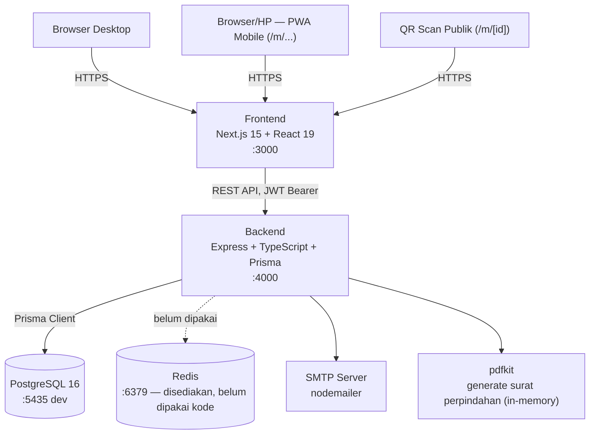

# Arsitektur — Database Warga GKJJ

> Di-generate oleh skill `/docs arch` dari struktur monorepo aktual (`apps/api`, `apps/web`, `docker-compose.yml`, `DEPLOY.md`).
> Last updated: 8 Juli 2026

## Diagram (ASCII)

```
┌──────────────────────────────────────────────────────────────────┐
│                    Database Warga GKJJ (GKJ Jakarta)              │
└──────────────────────────────────────────────────────────────────┘

Browser (desktop)         Browser/HP (PWA mobile, /m/...)      QR scan (publik)
       │                          │                                  │
       └──────────────┬───────────┴──────────────┬───────────────────┘
                       │ HTTPS                    │
                       ▼                          ▼
              ┌──────────────────────────────────────┐
              │              Frontend                 │
              │  Next.js 15 + React 19 (App Router)   │
              │  TanStack Query/Table, Tailwind        │
              │  dev :3000 · prod via Nginx + PM2      │
              └───────────────────┬────────────────────┘
                                   │ REST API (axios, JWT Bearer)
                                   ▼
              ┌──────────────────────────────────────┐
              │               Backend                 │
              │  Express + TypeScript + Prisma ORM     │
              │  Zod validation, express-rate-limit    │
              │  dev :4000 · prod via Nginx + PM2      │
              └───┬──────────────┬──────────────┬──────┘
                  │              │              │
                  ▼              ▼              ▼
         ┌────────────────┐  ┌─────────┐  ┌───────────────────┐
         │  PostgreSQL 16  │  │  Redis   │  │  SMTP (nodemailer) │
         │  :5435 (dev)    │  │  :6379   │  │  Reset password &  │
         │  docker-compose │  │  disedia-│  │  surat perpindahan │
         │                 │  │  kan, ▲  │  │  (mode dev = log   │
         │                 │  │  belum   │  │  ke console)       │
         │                 │  │  dipakai │  │                    │
         │                 │  │  kode    │  │                    │
         └────────────────┘  └─────────┘  └───────────────────┘

Dalam proses Backend juga men-generate PDF surat perpindahan (pdfkit, in-memory,
tidak disimpan ke disk) dan QR code kartu anggota (qrcode, di sisi frontend).
```

> ▲ **Catatan:** Redis sudah disediakan di `docker-compose.yml` (port 6379) tapi saat ini **belum dipakai** oleh kode `apps/api` — tidak ada import client Redis di source. Jangan asumsikan caching/session/queue berjalan lewat Redis sampai ada implementasi nyata.

## Diagram (Mermaid)



## Monorepo (Turborepo)

```
Database-Warga-GKJJ/
├── apps/
│   ├── api/     Backend Express + Prisma — lihat docs/API_REFERENCE.md
│   └── web/     Frontend Next.js (dashboard desktop + PWA mobile /m/...)
├── packages/    Kode/types bersama antar apps (mis. packages/types)
├── sprints/     Sprint plan untuk eksekusi via skill /sprint
├── deploy/      Script setup VPS, config PM2 (ecosystem.config.cjs), Nginx
└── docker-compose.yml   Postgres + Redis untuk development lokal
```

## Alur Deploy (Production)

Lihat detail lengkap di [`DEPLOY.md`](../DEPLOY.md). Ringkasan:

```
Developer (git push)
     │
     ▼
VPS Ubuntu 22.04 (Domainesia Cloud VPS Lite 2GB)
     │
     ├── Build: npm install → prisma generate → npm run build (api & web)
     ├── PM2 (ecosystem.config.cjs) — proses `api` (:4000) dan `web` (:3000)
     └── Nginx (reverse proxy + SSL via Certbot)
            ├── jemaat.gkjjakarta.org  → proxy → :3000 (web)
            └── api.gkjjakarta.org     → proxy → :4000 (api)
```

Environment testing terpisah tersedia di `jemaat.purwandaru.com` / `api.purwandaru.com` (lihat `deploy/nginx-*.dev.conf`).

## Autentikasi & Otorisasi

- **JWT Bearer** (`jsonwebtoken`), password di-hash dengan `bcryptjs`.
- Middleware `authenticate` (wajib login) dan `authorize(...roles)` (role-gated) di `apps/api/src/middleware/auth.ts`, dipasang per-router atau per-route.
- 6 role: `SUPERADMIN`, `KEPALA_KANTOR`, `MAJELIS`, `STAF_ADMIN`, `PENATUA_KELOMPOK`, `VIEWER` — lihat matriks akses lengkap di [README § Role & Hak Akses](../README.md#role--hak-akses).
- Field sensitif (NIK, koordinat GPS, alamat KTP, kontak) di-redaksi otomatis per role di layer service (`sanitizeForRole`), bukan di frontend — konsisten untuk semua konsumen API.

## Kepatuhan Data Pribadi (UU PDP No. 27/2022)

- Enkripsi NIK at-rest (AES-256, `apps/api/src/utils/crypto.ts`).
- Audit trail akses (`AuditLog`, action `ACCESS`) untuk setiap `GET /warga/:id`.
- Sanitasi `ActivityLog` — field sensitif dihapus/dimask sebelum disimpan.
- Halaman publik `/kebijakan-cookie`, `/kebijakan-privasi`, dan cookie consent banner (site-wide, `localStorage`).

Detail lengkap: [README § Keamanan & Kepatuhan PDP](../README.md#keamanan--kepatuhan-pdp).
